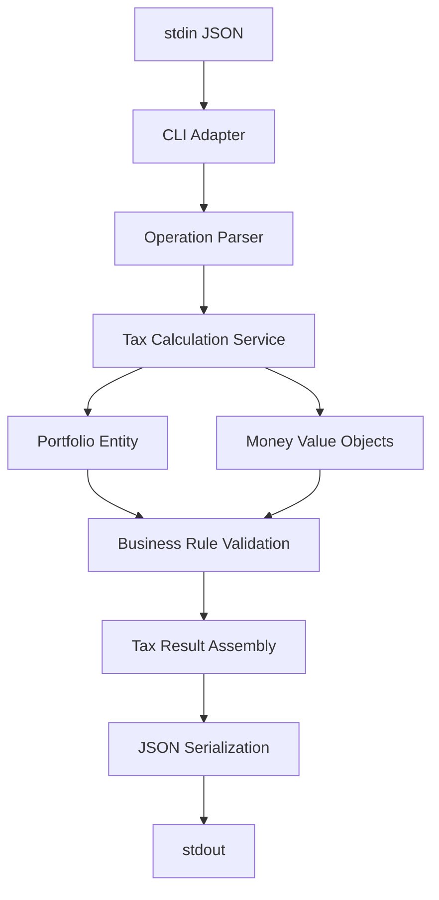

# Capital Gains Tax Calculator

CLI que calcula impostos sobre ganhos de capital conforme especificação do desafio.

## Como Executar

### 1. Setup (uma vez só)

```bash
npm install
npm run build
```

### 2. Testar se está funcionando

```bash
# Teste básico - deve retornar [{"tax":0}]
echo '[{"operation":"buy", "unit-cost":10.00, "quantity": 100}]' | npm start
```

### 3. Executar com arquivo de entrada

```bash
npm start < entrada-completa.json
```

### 4. Modo interativo

```bash
npm start
# Digite uma linha JSON e pressione Enter
# Digite linha vazia para finalizar
```

## Formato de Entrada e Saída

**Entrada**: Uma linha por simulação (array JSON)

```json
[{"operation":"buy", "unit-cost":10.00, "quantity": 100}]
[{"operation":"buy", "unit-cost":10.00, "quantity": 10000}, {"operation":"sell", "unit-cost":20.00, "quantity": 5000}]
```

**Saída**: Uma linha por resultado

```json
[{"tax":0}]
[{"tax":0},{"tax":10000}]
```

## Exemplos de Teste

### Caso Simples

```bash
echo '[{"operation":"buy", "unit-cost":10.00, "quantity": 100}]' | npm start
# Resultado: [{"tax":0}]
```

### Caso com Lucro

```bash
echo '[{"operation":"buy", "unit-cost":10.00, "quantity": 10000}, {"operation":"sell", "unit-cost":20.00, "quantity": 5000}]' | npm start
# Resultado: [{"tax":0},{"tax":10000}]
```

### Múltiplas Simulações

```bash
cat > teste.json << 'EOF'
[{"operation":"buy", "unit-cost":10.00, "quantity": 100}]
[{"operation":"buy", "unit-cost":10.00, "quantity": 10000}, {"operation":"sell", "unit-cost":20.00, "quantity": 5000}]
EOF

npm start < teste.json
```

## Validar se Está Funcionando

```bash
# 1. Compilar
npm run build

# 2. Executar testes
npm test

# 3. Teste manual rápido
echo '[{"operation":"buy", "unit-cost":10.00, "quantity": 100}]' | npm start
```

Se retornar `[{"tax":0}]`, está funcionando corretamente.

---

## 🏗️ Arquitetura e Estrutura do Projeto

### Decisões Arquiteturais Fundamentais

Este projeto implementa uma **arquitetura limpa** baseada em **Domain-Driven Design (DDD)** com separação clara de responsabilidades, priorizando **simplicidade operacional** conforme especificações do Nubank.

#### Stack Tecnológico e Justificativas

```typescript
// Tecnologias Core
TypeScript 5.8+     // Type safety para cálculos financeiros críticos
Node.js 18+         // Runtime estável com suporte nativo a ES2020
Decimal.js          // Precisão aritmética para operações monetárias
Jest               // Framework de testes com coverage integrado
```

**Rationale Técnico:**
- **TypeScript**: Elimina classes de erros em runtime através de verificação estática
- **Decimal.js**: Resolve problemas de precisão IEEE 754 em cálculos monetários (`0.1 + 0.2 ≠ 0.3`)
- **Node.js**: Suporte nativo a streams para I/O eficiente em grandes volumes

### Estrutura Hierárquica do Sistema

```
capital-gains/                           # Project Root Container
├── src/                                 # Source Code Boundary
│   ├── domain/                          # Core Domain Layer (Business Logic)
│   │   ├── constants/                   # Domain Constants Module
│   │   │   └── tax-constants.ts         # Centralized Business Rules
│   │   ├── entities/                    # Domain Entities Container
│   │   │   └── Portfolio.ts             # Aggregate Root Implementation
│   │   └── value-objects/               # Immutable Value Objects
│   │       └── Money.ts                 # Monetary Precision Abstraction
│   ├── services/                        # Application Services Layer
│   │   └── tax-calculation.services.ts  # Domain Orchestration Service
│   ├── tests/                          # Comprehensive Testing Suite
│   │   ├── calculator.test.ts           # Business Logic Unit Tests
│   │   ├── integration.test.ts          # End-to-End Validation Tests
│   │   ├── money.test.ts               # Value Object Behavior Tests
│   │   ├── portfolio.test.ts           # Entity State Management Tests
│   │   └── tax-calculation-service.test.ts  # Service Layer Tests
│   ├── calculator.ts                    # Facade Pattern Implementation
│   ├── index.ts                        # CLI Entry Point & I/O Adapter
│   └── types.ts                        # TypeScript Contract Definitions
├── dist/                               # Compiled JavaScript Output
├── coverage/                           # Test Coverage Reports
├── package.json                        # Dependency Manifest & Scripts
├── tsconfig.json                       # TypeScript Compiler Configuration
├── jest.config.js                     # Testing Framework Configuration
├── entrada-completa.json              # Specification Test Cases
└── README.md                          # Technical Documentation
```

### Implementação de Padrões Arquiteturais

#### **Domain Layer: Core Business Logic**

```typescript
// Value Object Pattern - Immutable Monetary Operations
export class Money {
  private readonly amount: Decimal;
  
  // Factory Methods Pattern
  static zero(): Money
  static fromNumber(value: number): Money
  
  // Immutable Operations
  add(other: Money): Money
  multiply(factor: number): Money
  // ... preserves immutability across operations
}
```

#### **Entity Pattern: Portfolio Aggregate Root**

```typescript
export class Portfolio {
  // Encapsulated State Management
  private shares: number = 0;
  private averagePrice: Money = Money.zero();
  private accumulatedLoss: Money = Money.zero();
  
  // Business Logic Encapsulation
  recordPurchase(quantity: number, unitPrice: Money): void
  calculateCostBasis(quantity: number): Money
  applyLossDeduction(grossProfit: Money): Money
}
```

#### **Service Layer: Application Orchestration**

```typescript
export class TaxCalculationService {
  // Strategy Pattern Implementation
  private processOperation(operation: Operation): TaxResult {
    return operation.operation === 'buy'
      ? this.processBuyOperation(operation)
      : this.processSellOperation(operation);
  }
  
  // Command Pattern for Operation Processing
  private processSellOperation(operation: Operation): TaxResult {
    const salesDetails = this.calculateSaleDetails(operation);
    const operationResult = this.calculateOperationResult(salesDetails);
    // ... orchestrates domain logic
  }
}
```

### Fluxo de Dados e Processamento

#### **Data Flow Architecture**



#### **Processing Pipeline Implementation**

```typescript
// Stream-based I/O Processing
async function main(): Promise<void> {
  const rl = readline.createInterface({
    input: process.stdin,    // Standard input stream
    output: process.stdout,  // Standard output stream
    terminal: false          // Non-interactive mode for pipes
  });

  // Asynchronous line processing with error boundaries
  for await (const line of rl) {
    try {
      const operations: Operation[] = JSON.parse(line);
      const results = calculateTaxes(operations);
      console.log(JSON.stringify(results));
    } catch (error) {
      console.log('[]'); // Graceful degradation
    }
  }
}
```

### Configuração de Build e Desenvolvimento

#### **TypeScript Configuration Matrix**

```json
// tsconfig.json - Production-Ready Configuration
{
  "compilerOptions": {
    "target": "ES2020",                    // Modern JavaScript features
    "module": "commonjs",                  // Node.js compatibility
    "strict": true,                        // Maximum type safety
    "noUnusedLocals": true,               // Eliminate dead code
    "noImplicitReturns": true,            // Exhaustive return checking
    "noFallthroughCasesInSwitch": true    // Switch statement safety
  }
}
```

#### **Testing Strategy Implementation**

```javascript
// jest.config.js - Comprehensive Testing Setup
module.exports = {
  testEnvironment: "node",               // Node.js runtime simulation
  transform: {
    "^.+\\.ts$": "ts-jest"              // TypeScript transformation
  },
  collectCoverageFrom: [
    "src/**/*.ts",                       // Source coverage
    "!src/tests/**"                      // Exclude test files
  ],
  coverageThreshold: {
    global: {
      branches: 90,                      // Branch coverage target
      functions: 90,                     // Function coverage target
      lines: 90,                         // Line coverage target
      statements: 90                     // Statement coverage target
    }
  }
};
```

### Domain-Specific Implementation Patterns

#### **Financial Precision Strategy**

```typescript
// Decimal.js Configuration for Financial Accuracy
constructor(value: number | string | Decimal) {
  Decimal.set({ 
    precision: 20,                    // Extended precision for intermediary calculations
    rounding: Decimal.ROUND_HALF_UP   // Standard financial rounding
  });
  this.amount = new Decimal(value);
}
```

#### **Business Rules Centralization**

```typescript
// Domain Constants Pattern
export const TaxConstants = {
  CAPITAL_GAINS_TAX_RATE: 0.20,        // 20% tax rate
  EXEMPTION_THRESHOLD: 20000,          // R$ 20,000 exemption limit
  DECIMAL_CONFIG: {
    precision: 20,                     // Calculation precision
    rounding: 8                        // ROUND_HALF_UP
  }
} as const;
```

### Performance Characteristics and Scalability

#### **Computational Complexity Analysis**

| Operation | Time Complexity | Space Complexity | Rationale |
|-----------|----------------|------------------|-----------|
| Purchase Processing | O(1) | O(1) | Direct weighted average calculation |
| Sale Processing | O(1) | O(1) | Linear profit/loss computation |
| Portfolio State Update | O(1) | O(1) | In-place state modification |
| JSON Parsing/Serialization | O(n) | O(n) | where n = JSON string length |

#### **Memory Management Strategy**

```typescript
// Immutable State Management
class Portfolio {
  // State encapsulation prevents memory leaks
  private shares: number = 0;
  private averagePrice: Money = Money.zero();
  
  // Factory method for clean state creation
  static fromLegacyState(state: LegacyPortfolioState): Portfolio {
    // Controlled state reconstruction
  }
}
```

### Extensibility and Maintenance Vectors

#### **Future Enhancement Patterns**

```typescript
// Strategy Pattern enables tax rule extensions
interface TaxStrategy {
  calculateTax(profit: Money, saleValue: Money): Money;
}

class BrazilianCapitalGainsTax implements TaxStrategy {
  // Current implementation
}

class USCapitalGainsTax implements TaxStrategy {
  // Future implementation for different jurisdiction
}
```

#### **Clean Architecture Benefits**

- **Testability**: Domain logic isolated from I/O concerns
- **Maintainability**: Clear separation enables focused modifications
- **Extensibility**: New tax rules integrate without core changes
- **Compliance**: Architecture supports financial audit requirements

---

## Solução de Problemas

**"Comando não encontrado"**: Execute `npm run build` primeiro

**"JSON inválido"**: Verifique se o JSON está bem formatado

**"Sem saída"**: Certifique-se de finalizar com linha vazia no modo interativo

## Scripts Disponíveis

```bash
npm run build         # Compila o projeto
npm start             # Executa o CLI
npm test              # Executa testes
npm run clean         # Limpa arquivos gerados
npm run test:coverage # Executa testes com cobertura
```

---

**Para avaliadores**: Este projeto implementa exatamente a especificação fornecida usando arquitetura limpa e padrões enterprise. Use `npm start < entrada-completa.json` para testar todos os casos de uma vez.


